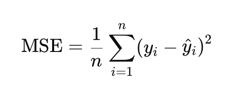
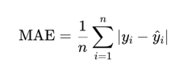
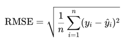
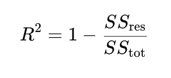
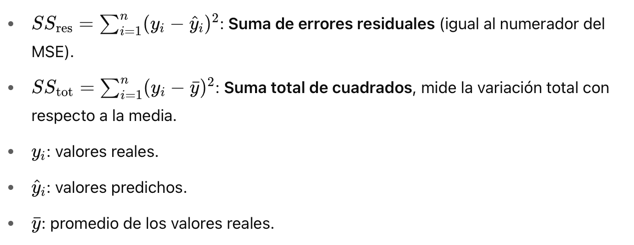

# Tarea
Alisson García Mejía

**Instrucciones:** Investigar la fórmula, definición, en qué se aplican las siguientes fórmulas para calcular el error:

### MSE (Mean Squared Error)

El Error Cuadrático Medio (MSE) es una medida estadística que cuantifica la 
diferencia promedio al cuadrado entre los valores reales y los valores 
predichos por un modelo. Es ampliamente utilizada para evaluar la calidad de 
un modelo de regresión >rojo.

#### Fórmula

En donde: 

* n: es el número total de muestras

* yi: es el valor real u observado en la muestra i 

* y^i: es el valor predicho por el modelo para la muestra i 

Por ejemplo: 

* Si los valores reales son: 2, 5 y 9 

* Si los valores predichos son: 3, 5 y 11 

Al aplicar la fórmula el valor de 5/3 = 1.666 

También se puede aplicar esta fórmula mediante:
sklearn.metrics import mean_squared_error 

Una **ventaja** es que penaliza fuertemente los errores grandes, pero
una **desventaja** es que no está en las mismas unidades que los datos
originales (es por eso que se prefiere la RMSE, raíz del MSE). 

### MAE (Mean Absolute Error)

El Error Absoluto Medio es una medida estadística que representa el promedio de las diferencias 
absolutas entre los valores reales y los valores predichos por un modelo. 
Mide altamente el tamaño del error sin importar su dirección (positivo o negativo). 

#### Fórmula

En donde: 

* n: es el número total de muestras

* yi: es el valor real (observado) en la muestra i 

* y^i: es el valor predicho por el modelo para la muestra i 

* |•|: el valor absoluto 

Las **ventajas** son que es fácil de interpretar, ya que está en las mismas unidades que los datos originales, y es menos sensible a los outliers que el MSE. 
Sim embargo, su **desventaja** es que no penaliza fuertemente
los errores grandes, por lo que puede no ser ideal si se quiere castigar predicciones muy erróneas. 

Suele usarse en modelos de regresión en aprendizaje automático para evlauar la presición sin penalizar fuertemente
los errores grandes. O para medir la calidad de predicciones en variables que cambian
con el tiempo. 

### RMSE (Root Mean Squared Error)

La Raíz del Error Cuadrático Medio es la raíz cuadrada del MSE. Mide el promedio de la magnitud de los errores
entre los valores reales y predichos, pero, a diferencia del MSE, **lo expresa en las mismas
unidades que la variable de salida**, lo que facilita su interpretación

#### Fórmula

En donde: 
* n: es el número de muestras
* yi: valor real para la muestra i 
* ^yi: es el valor predicho por el modelo

Suele usarse para **evaluar la precisión del modelo** y cuando los **errores grandes deben penalizarse más** 
Sin embargo, es menos robusto ante outliers, comparado con el MAE. 

### R-squared

También llamado "coeficiente de determinación" o R^2. Mide qué tan bien un modelo de regresión explica la 
variabilidad de la variable dependiente (la que se quiere predecir).
Su valor va de 0 a 1 (o negativo si es el modelo es muy malo). 

#### Fórmula 

Dónde: 

 Suele usarse para evaluar modelos de regresión, especialmente en problemas donde queremos saber
qué tanto de la variabilidad de los datos es explicada por el modelo y para comprar qué modelo explica mejor los datos.

Aunque sus **ventajas** engloban, que es fácil de interpretar y es útil para comparar modelos. Sus **desventajas** conllevan que no 
siempre mejora con mejor ajuste, por lo que se puede ser engañosos con modelos no lineales, además de que no penaliza la
complejidad del modelo, para esto a veces se prefiere el R^2 ajustado. 
